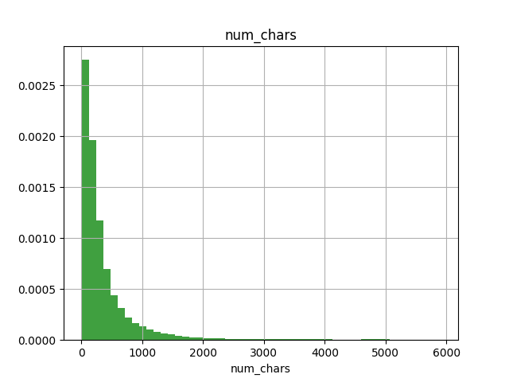
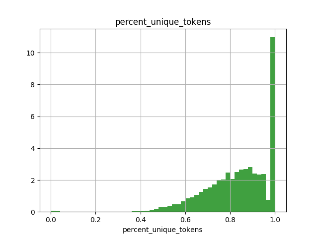

# Troll hunting: Detecting toxic internet comments with multi-task Deep Learning

**tl;dr:** TODO

## Background

## Data

Google's [ConversationAI](https://conversationai.github.io/) team sponsored the project, and provided 561,808 text 
comments. For each of these comments, they have provided binary labels for 7 types of toxic behaviour 
(see Schema below). 

| variable      | type  |
|---------------|-------|
| id            | int64 |
| comment_text  | str   |
| toxic         | bool  |
| severe_toxic  | bool  |
| obscene       | bool  |
| threat        | bool  |
| insult        | bool  |
| identity_hate | bool  |

*Schema for input data set, provided by Kaggle* 

Additionally, there are two highly unique attributes for this data set:

 - **Overlapping labels**: Observations in this data set can belong to multiple classes, and any permutation of 
 these classes. An observation could be described as `toxic`, `toxic and threat` or `no classification`. This is a 
 break from most classifications, which have mutually exclusive response variables (e.g. either `cat` or `dog`, but not 
 both)   
 - **Class imbalance**: The vast majority of observations are not toxic in any way, and have all `False` 
 labels. This provides a few unique challenges, particularly in choosing a loss function, metrics, and model 
 architectures.
 
Once I had the data set in hand, I performed some cursory ETA to get an idea of post length, label distribution, and 
vocabulary size (see below). 

*Histogram of number of characters in each observation*

*Histogram of number of `set(post_tokens)/len(post_tokens)`, or roughly how many unique words there are in each post*

### Data Transformations

Finally, I was able to start ETL'ing the data set. Given the diverse and non-standard vocabulary used in many posts 
(and in particular toxic posts), I chose to build a character level model instead of a token (word) level model. 

I stole the ETL process from my [spoilers model](https://github.com/bjherger/spoilers_model), and performed the following transformations to create the X matrix:

 
 - All characters were converted to lower case
 - All character that were not in a pre-approved set were replaced with a space
 - All adjacent whitespaces were replaced with a single space
 - Start and end markers were added to the string
 - The string was converted to a fixed length pre-padded sequence, with a distinct padding character. Sequences longer than the prescribed length were truncated.
 - Strings were converted from an array of characters to an array of indices
 - The y arrays, containing booleans, required no modification

As an example, the comment `What are you stalking my edits or something?` would be come: 
`['<', 'w', 'h', 'a', 't', ' ', 'a', 'r', 'e', ' ', 'y', 'o', 'u', ' ', 's', 't', 'a', 'l', 'k', 'i', 'n', 'g', ' ', 
'm', 'e', ' ', 'o', 'r', ' ', 's', 'o', 'm', 'e', 't', 'h', 'i', 'n', 'g', '?', '>']` (I've omitted the padding, as 
I'm not paid by the character. Actually, I don't get paid for this at all. )
 
## Modeling

While designing, and implementing models, there were a variety of decisions to make, stemming from the data set's 
overlapping labels and class imbalance. 

First and foremost, the overlapping labels provided for a few different modeling approaches:

 - **One model per label (OMPL)**: For each label, train one model to detect if an observation belongs to that label or 
 not. (e.g. `obscene` or `not obscene`). This approach would require significant train time for each label. Additionally
 , deploying this model would require handling multiple model pipelines.  
 - **OMPL w/ transfer learning**: Similar to OMPL, train one model for each label. However, instead of training each 
 model from scratch, we could train a base model on label A, and clone it as the basis for future models. This 
 methodology is beyond the scope of this post, but [Pratt](http://papers.nips.cc/paper/641-discriminability-based-transfer-between-neural-networks.pdf) covers it well.
 This approach would require significant train time for the first model, but relatively little train time for 
 additional labels. However, deploying this model would still require handling multiple model pipelines.      
 - **One model, multiple output layers** Also known as multi-task learning, this approach would have one input layer, 
 one set of hidden layers, and one output layer for each label. Heuristically, this approach takes less time than OMPL, 
 and more time than OMPL w/ transfer learning. However, training time can benefit all labels directly, and hidden layer 
 more model architectures can be effectively evaluated. Additionally, deploying this approach would only require 
 handling a single model pipeline. The back propagation for this approach is a bit funky, but gradients are 
 effectively averaged (the chaos dies down after the first few batches). 
 
Ultimately, I focused on the one model, multiple output layers approach. However, as discussed in *Future Work*, it 
would be beneficial to compare and contrast these approaches on a single data set.   

Additionally, class imbalance can cause some issues with choosing the right metric to evaluate. So much so that the 
evaluation metric for this competition was actually changed mid-competition from cross-entropy to AUC. The core issue 
here is that choosing the most common label (also known as the ZeroR model) actually provides a high accuracy. For 
example, if 99% of observations had `False` labels, always responding `False` would result in a 99% accuracy. 

To overcome this issue, the Area under the ROC Curve (AUC) metric is commonly used. This metric measures how well 
your model correctly separates the two classes, by varying the probability threshold used in classification. SKLearn 
has a pretty strong [discussion](http://scikit-learn.org/stable/auto_examples/model_selection/plot_roc.html) of AUC.

Unfortunately AUC can't be used as a loss (though TF has a [good proxy](http://tflearn.org/objectives/#roc-auc-score)), 
so I proceeded with a binary cross-entropy loss.      

## Conclusion

Overall, this project was a rare opportunity to use a clean, free, well-labeled text data set, and a fun endeavour into 
multi-task learning. While I've made many greedy choices in designing model architectures, I've efficiently arrived a 
strong model that performed well with surprisingly little training time. 

### Future Work

There are always many paths not taken, but there are a few areas I'd like to dive into further, particularly with this 
hand-labelled data set. These are, in no particular order:

 - **Token level models:** While benchmarks are always difficult, it would be interesting to benchmark a token (word) 
 level model against this character level model
 - **Wider networks:** Because LSTMs are incredibly expensive to train, I've utilized a relatively narrow 
 bi-directional LSTM layer for all models so far. Additionally, there is only one, relatively narrow dense layer after 
 the LSTM layer. 
 - **Coarse / fine model** The current suite of models attempt to directly predict whether an observation is a 
 particular type of toxic comment. However, an existing heuristic for imbalanced data sets is to train a first model to 
 determine if an observation is intersting (in this case are any of the response variables `True`), and then use the 
 first model to filter observations into a second model (for us: Given that this is toxic, which type of toxic is it?). 
 This would require a fair bit more data pipelining, but might allow the system to more accurately segment out toxic 
 comments.
 
## Resources

TODO GH  